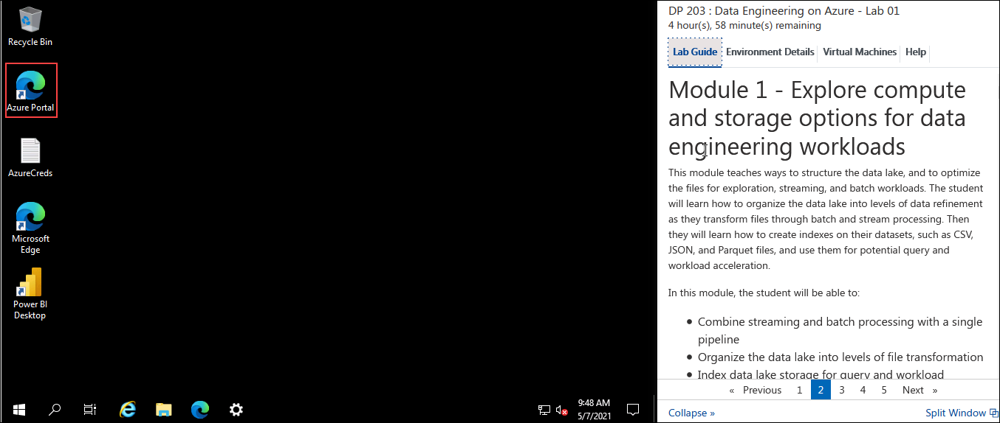

## **Getting Started**

## Log-in to the Azure portal

1. In the LabVM, double click on the Azure portal shortcut on the desktop.

      
     
2. On **Sign in to Microsoft Azure** blade, you will see a login screen, in that enter the following email/username and then click on **Next**.  
   * **Azure Usename/Email**:  <inject key="AzureAdUserEmail"></inject>
   * **Azure Password**:  <inject key="AzureAdUserPassword"></inject>

2. If you see the pop-up  **Stay Signed in?**, click **No**

3. If you see the pop-up **You have free Azure Advisor recommendations!** , close the window to continue the lab. 

4. If a **Welcome to Microsoft Azure** popup window appears, click **Maybe Later** to skip the tour.

5. Click on **Next** from the bottom right corner and follow the instructions to perform the lab.

## Modules Included

   In this hands on lab you will perform the following modules:

 - [Module 1](https://github.com/MicrosoftLearning/DP-203T00-Data-Engineering-on-Microsoft-Azure/tree/master/Instructions/Labs/01)  
 - [Module 6](https://github.com/MicrosoftLearning/DP-203T00-Data-Engineering-on-Microsoft-Azure/tree/master/Instructions/Labs/06)
 - [Module 15](https://github.com/MicrosoftLearning/DP-203T00-Data-Engineering-on-Microsoft-Azure/tree/master/Instructions/Labs/15)
 - [Module 17](https://github.com/MicrosoftLearning/DP-203T00-Data-Engineering-on-Microsoft-Azure/tree/master/Instructions/Labs/17)

